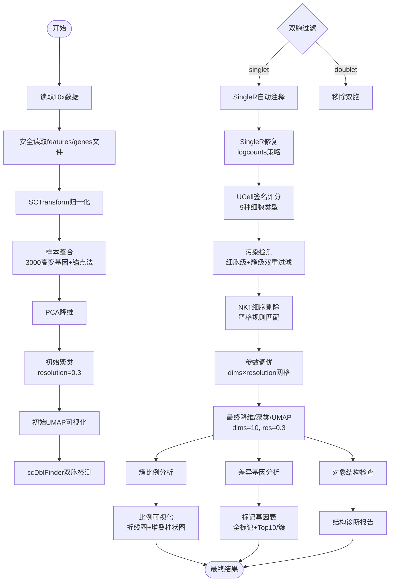

# scRNA-seq NASH NK细胞分析项目

## 项目概述

本项目专注于 NASH（非酒精性脂肪性肝炎）疾病模型中 NK 细胞的单细胞 RNA 测序分析。通过分析不同时间点（0 周、1 周、2 周、6 周）的 NK 细胞样本，研究 NASH 疾病进程中 NK 细胞的变化规律。

## 项目框架


## 项目结构（当前主路径：2_DataProcessing/*）

```
scRNA-seq/
├── README.md
├── .gitignore
├── 1_Files/                          # 原始/预处理数据（按分组）
│   ├── NK1.1/
│   └── CD45.2/
├── 2_DataProcessing/                 # 主数据处理管线（脚本与产物）
│   ├── 1_Samples_Merging/
│   │   ├── Scripts & guidedoc*.md
│   │   └── Results/{data,plots,rds}
│   ├── 2_Doublet_Removed/            # 去双胞/注释/清理产出（报告与图件）
│   │   ├── RDS/                      # R 对象（清理后 / 单细胞注释 / noNKT / tuned）
│   │   ├── plots/                    # UMAP 等图件
│   │   └── reports/                  # 报告（cleaning / singleR 修复 / noNKT）
│   ├── 3_UMAP-Tuning/                # UMAP 调参与选择产出（metrics/plots/logs）
│   │   ├── data/                     # 调参指标与候选 CSV
│   │   ├── plots/                    # 调参热力图与候选 UMAP
│   │   └── logs/                     # 运行配置与会话信息
│   └── Scripts/                      # 脚本（生成、清理、调参）
│       ├── generate_umap_nk.R
│       ├── generate_umap_nk_post.R
│       ├── remove_doublets_and_contaminants.R
│       ├── singleR_annotation_fix.R
│       ├── remove_NKT_cells.R                  # 新增：在已注释对象上剔除 NKT
│       └── tune_noNKT_dims_resolution.R        # 新增：基于 noNKT 对象进行 dims × resolution 调参并重跑
├── 2_Filter/                         # 可选镜像产出目录（按你的偏好保留）
│   └── 2_Doublet_Removed/{RDS,plots,reports}
└── 3_Analysis/                       # 下游分析
    ├── 1.ClusterAnalysis/            # 簇比例与差异基因分析产出
    │   ├── data/                     # CSV 表格（比例/markers）
    │   ├── plots/                    # 图件（折线/堆叠）
    │   └── logs/                     # 运行日志与会话信息
    └── Scripts/                      # 下游分析脚本
        ├── export_cluster_proportions.R        # 按时间点×簇统计并绘图
        ├── find_cluster_markers.R             # 每簇差异基因（CLI 参数版，含回退策略）
        └── find_markers_simple.R              # 每簇差异基因（简化版，快速产出）
```

历史路径兼容（Files/*）说明：
- 早期版本产物位于 `Files/UMAP/*` 与 `Files/Doublet_Removed/*`。当前主路径已迁移至 `2_DataProcessing/*`，新产物与脚本请以该路径为准。

## 样本与分组信息
- 分组：NCD（0W）与 MCD（1W/2W/6W）
- 细胞类型：NK1.1（自然杀伤细胞）与 CD45.2（白细胞共同抗原）

## 分析流程概览

1) 样本合并与整合（SCTransform + Anchors）  
2) 去双胞（scDblFinder，按样本/时间点分组）  
3) 自动注释（SingleR，logcounts 修复策略）  
4) UCell 基因签名评分（NK/T/B/Myeloid/DC/Plasma/Endothelium/Fibroblast/Hepatocyte）  
5) 去污染（细胞级阈值 + 簇级非 NK 占比阈值）  
6) 重跑降维/聚类/UMAP（兼容 SCT/RNA 多模型，必要时回退）  
7) NKT 剔除（基于 SingleR 标签严格规则）  
8) dims × resolution 调参（UMAP/聚类）与最终参数选择  
9) 按最终参数生成分面 UMAP（timepoint）与标签 UMAP（SingleR）

## 关键技术与兼容策略

- 平台/框架：R、Seurat 5.x、SingleCellExperiment、scDblFinder、SingleR、celldex、scater、UCell、ggplot2、patchwork
- Seurat v5 多层 assay 差异：
  - 优先使用 layer 接口获取数据，必要时回退 slot 接口；兼容 RNA/SCT/integrated
  - 避免直接 `as.SingleCellExperiment(seu)`，显式构建 SCE 并确保 counts/logcounts 与 colData 对齐
- SingleR 修复策略：
  - 从 Seurat 提取 counts → SCE → `scater::logNormCounts` 生成 logcounts → SingleR 显式 `assay.type="logcounts"`
- 去污染判定：
  - 细胞级：NK_UCell ≥ P60 且 Δ(NK − max(others)) ≥ 0.05，或 SingleR 注释命中 NK/ILC
  - 簇级：簇内非 NK 注释占比 ≥ 0.7 则整体剔除
- 降维稳健性：
  - RNA：NormalizeData → FindVariableFeatures → ScaleData → RunPCA
  - SCT：直接使用 VariableFeatures；若 SCT 无 VF 则回退 RNA 并自动计算 HVG

## 使用说明（一键运行关键步骤）

1) 在已完成 SingleR 注释的对象上剔除 NKT
- 输入：`2_DataProcessing/2_Doublet_Removed/RDS/nk.integrated.singleR_annotated.rds`
- 运行：
  ```bash
  Rscript 2_DataProcessing/Scripts/remove_NKT_cells.R
  ```
- 产出：
  - `2_DataProcessing/2_Doublet_Removed/RDS/nk.integrated.noNKT.rds`
  - `2_DataProcessing/2_Doublet_Removed/reports/noNKT_removal_report.md`
  - `2_DataProcessing/2_Doublet_Removed/reports/removed_NKT_cell_ids.csv`
  - `2_DataProcessing/2_Doublet_Removed/plots/NKT_removal_label_counts_before_after.png`

2) 基于 noNKT 对象进行 dims × resolution 调参并重跑
- 输入：`2_DataProcessing/2_Doublet_Removed/RDS/nk.integrated.noNKT.rds`
- 运行：
  ```bash
  Rscript 2_DataProcessing/Scripts/tune_noNKT_dims_resolution.R
  ```
- 产出：
  - 调参指标：`2_DataProcessing/3_UMAP-Tuning/data/nk_noNKT_tuning_metrics.csv`
  - 候选组合：`2_DataProcessing/3_UMAP-Tuning/data/nk_noNKT_tuning_best_per_dims.csv`
               `2_DataProcessing/3_UMAP-Tuning/data/nk_noNKT_tuning_top_candidates.csv`
  - 热力图/分面：`2_DataProcessing/3_UMAP-Tuning/plots/heatmap_*_noNKT.(png|pdf)`
                 `2_DataProcessing/3_UMAP-Tuning/plots/UMAP_noNKT_tuning_dims*_res*_byTimepoint.(png|pdf)`
  - 最终对象：`2_DataProcessing/2_Doublet_Removed/RDS/nk.integrated.noNKT.tuned.rds`
  - 最终图件：`2_DataProcessing/3_UMAP-Tuning/plots/UMAP_noNKT_final_byTimepoint.png`
               `2_DataProcessing/3_UMAP-Tuning/plots/UMAP_noNKT_final_bySingleR.png`
  - 参数与日志：`2_DataProcessing/3_UMAP-Tuning/logs/selected_params.txt`
                `2_DataProcessing/3_UMAP-Tuning/logs/run_config_*.txt`
                `2_DataProcessing/3_UMAP-Tuning/logs/sessionInfo_*.txt`

## 使用说明（下游分析 3_Analysis）

前置输入：`1_Files/RDS/nk1.1_integrated.tuned.rds`（含 `timepoint`、`seurat_clusters` 等元数据字段）

A) 按时间点×簇导出比例并绘图
```bash
Rscript 3_Analysis/Scripts/export_cluster_proportions.R \
  --rds 1_Files/RDS/nk1.1_integrated.tuned.rds \
  --outdir 3_Analysis/1.ClusterAnalysis \
  --timepoint-order "0W_NCD,1W_MCD,2W_MCD,6W_MCD" \
  --topk 12 --formats "png,pdf" --width 9 --height 6 --dpi 300
```
- 输出：
  - `3_Analysis/1.ClusterAnalysis/data/cluster_counts_by_timepoint.csv`
  - `3_Analysis/1.ClusterAnalysis/data/cluster_proportions_by_timepoint.csv`
  - `3_Analysis/1.ClusterAnalysis/plots/cluster_proportion_lineplot.(png|pdf)`
  - `3_Analysis/1.ClusterAnalysis/plots/cluster_composition_stackedbar.(png|pdf)`
  - `3_Analysis/1.ClusterAnalysis/logs/run_config_*.txt`、`sessionInfo_*.txt`
- 说明：
  - 自动探测 `timepoint`，如需可通过 `--timepoint-col` 指定；顺序可通过 `--timepoint-order` 显式传入；
  - 优先采用 `meta.data$seurat_clusters` 作为簇来源，回退 `Idents(obj)`；
  - 已在脚本内对 Seurat v5 因子/字符比较、空值与顺序拼接做稳健处理并加入调试输出。

B) 每簇差异基因（两种方式二选一）
- 推荐（参数化 CLI 版，含 assay 回退）：  
  ```bash
  Rscript 3_Analysis/Scripts/find_cluster_markers.R \
    --rds 1_Files/RDS/nk1.1_integrated.tuned.rds \
    --outdir 3_Analysis/1.ClusterAnalysis \
    --assay-priority "integrated,SCT,RNA" \
    --cluster-col seurat_clusters \
    --only-pos TRUE --min-pct 0.1 --logfc-threshold 0.25 --test-use "wilcox" --topn 10
  ```
- 简化快速产出版（无参数）：  
  ```bash
  Rscript 3_Analysis/Scripts/find_markers_simple.R
  ```
- 输出：
  - `3_Analysis/1.ClusterAnalysis/data/markers_all_clusters.csv`
  - `3_Analysis/1.ClusterAnalysis/data/markers_top10_per_cluster.csv`
  - `3_Analysis/1.ClusterAnalysis/logs/find_markers_simple_*.txt`（或参数化脚本对应日志）
- 说明：
  - 会优先使用 integrated→SCT→RNA；若 RNA 被选且 data/VariableFeatures 为空，会自动执行 Normalize/FindVariableFeatures/Scale；
  - 如有性能需求，可安装 presto 包（Seurat 将自动切换更快的 Wilcoxon 实现）。

## 故障排查（FAQ）

- 报错 “missing value where TRUE/FALSE needed”
  - 原因：因子与空字符串比较、或顺序拼接含 NA/空值导致 if/while 接收到 NA；
  - 处理：脚本已改为“先字符过滤、再因子化”，并清洗与回退时间点顺序；可通过 `--timepoint-order` 显式指定顺序。
- Seurat v5 警告 “slot 已废弃、请用 layer”
  - 属正常版本提示；分析脚本兼容 layer/slot 接口，已在关键节点做回退与检查。
- FindAllMarkers 报错或返回 0 行
  - 请确认所选 assay 的 data/VariableFeatures 非空；可通过参数化脚本的 integrated→SCT→RNA 回退策略或在 RNA 上自动准备；
  - 可调整 `--min-pct`、`--logfc-threshold` 或 `--test-use "MAST"`。
- 运行缓慢
  - 建议安装 presto 包，并根据机器资源配置并行；当前参数化脚本已默认启用稳定执行策略。

## 主要脚本（当前有效）
- `2_DataProcessing/Scripts/remove_doublets_and_contaminants.R`：去双胞 + 注释 + UCell + 去污染 + 重分析主流程
- `2_DataProcessing/Scripts/singleR_annotation_fix.R`：SingleR 空 data 层修复（counts→logNormCounts→SingleR）
- `2_DataProcessing/Scripts/remove_NKT_cells.R`：在已注释对象上剔除 NKT 并生成报告与图件
- `2_DataProcessing/Scripts/tune_noNKT_dims_resolution.R`：基于 noNKT 对象进行 dims × resolution 调参、选择并重跑生成最终产物
- `3_Analysis/Scripts/export_cluster_proportions.R`：簇比例导出与绘图
- `3_Analysis/Scripts/find_cluster_markers.R`：参数化差异基因（integrated→SCT→RNA 回退）
- `3_Analysis/Scripts/find_markers_simple.R`：简化版差异基因（快速产出）
- 历史脚本（仍可参考）：`Files/UMAP/scripts/*`

## 主要结果（样例）
- 去双胞/清理整体：
  - `2_DataProcessing/2_Doublet_Removed/reports/cleaning_report.md`
  - `2_DataProcessing/2_Doublet_Removed/plots/UMAP_filtered_by_SingleR.png`
  - `2_DataProcessing/2_Doublet_Removed/plots/UMAP_filtered_clusters_by_Timepoint.png`
- NKT 剔除：
  - `2_DataProcessing/2_Doublet_Removed/reports/noNKT_removal_report.md`
  - `2_DataProcessing/2_Doublet_Removed/plots/NKT_removal_label_counts_before_after.png`
- 调参与最终：
  - `2_DataProcessing/3_UMAP-Tuning/data/nk_noNKT_tuning_metrics.csv`
  - `2_DataProcessing/3_UMAP-Tuning/plots/UMAP_noNKT_final_byTimepoint.png`
  - `2_DataProcessing/3_UMAP-Tuning/plots/UMAP_noNKT_final_bySingleR.png`
- 下游分析（3_Analysis）：
  - `3_Analysis/1.ClusterAnalysis/data/cluster_counts_by_timepoint.csv`
  - `3_Analysis/1.ClusterAnalysis/data/cluster_proportions_by_timepoint.csv`
  - `3_Analysis/1.ClusterAnalysis/plots/cluster_proportion_lineplot.(png|pdf)`
  - `3_Analysis/1.ClusterAnalysis/plots/cluster_composition_stackedbar.(png|pdf)`
  - `3_Analysis/1.ClusterAnalysis/data/markers_all_clusters.csv`
  - `3_Analysis/1.ClusterAnalysis/data/markers_top10_per_cluster.csv`

## 技术栈
- R、Seurat、SingleCellExperiment、scDblFinder、SingleR、celldex、scater、UCell、ggplot2、patchwork

## 注意事项
- `.gitignore` 默认排除大体量数据与图件/RDS 等产物；脚本与文档纳入版本控制
- Seurat 版本差异可能影响 `FindClusters` 图名称；已在脚本内自动选择可用 `graph.name`

## 更新

- 2025-10-20
  - 新增脚本：`Files/UMAP/scripts/remove_doublets_and_contaminants.R`（集成 scDblFinder 去双胞、SingleR 自动注释、UCell 签名评分、去污染规则与重分析的主流程）
  - 修复 Seurat v5 多层 assay 转换为 SCE 的问题，增强元数据行名对齐与日志/报告目录创建的健壮性

- 2025-10-20 深夜
  - 新增特异性 SingleR 修复脚本：`Files/UMAP/scripts/singleR_annotation_fix.R`（从 counts 构建 SCE，scater::logNormCounts 生成 logcounts，显式以 logcounts 作为 SingleR 输入，规避 data 层为空告警）
  - 产出对象与文档：
    - `Files/Doublet_Removed/RDS/nk.integrated.singleR_annotated.rds`
    - `Files/Doublet_Removed/reports/singleR_fix_report.md`
    - `Files/Doublet_Removed/plots/SingleR_label_barplot.png`

- 2025-10-21（清理与重分析）
  - 将 SingleR 修复策略集成至主流程并完成全流程清理与重分析（保留 NK/ILC）
  - 去双胞结果：移除 312 个细胞（约 1.61%）
  - 生成清理后对象与报告（历史路径 Files/*）：
    - `Files/Doublet_Removed/RDS/nk.integrated.filtered.rds`
    - `Files/Doublet_Removed/RDS/nk.integrated.doublet_scored.rds`
    - `Files/Doublet_Removed/reports/cleaning_report.md`
  - 图件（历史路径 Files/*）：DoubletScore、Cluster_nonNK_fraction、UMAP 等

- 2025-10-21（NKT 剔除 + UMAP 调参与最终）
  - 新增脚本：`2_DataProcessing/Scripts/remove_NKT_cells.R`（严格规则排除 NKT）
  - 新增脚本：`2_DataProcessing/Scripts/tune_noNKT_dims_resolution.R`（调参与最终降维/聚类/UMAP）
  - 产出：
    - NKT 剔除：19126 → 19007（移除 119，0.62%）
    - 调参指标与候选：`2_DataProcessing/3_UMAP-Tuning/data/*`
    - 最终参数：dims=10、res=0.3（见 `selected_params.txt`）
    - 最终对象与图：`2_DataProcessing/2_Doublet_Removed/RDS/nk.integrated.noNKT.tuned.rds`；`3_UMAP-Tuning/plots/*`

- 2025-10-21（下游分析 3_Analysis）
  - 新增脚本：`3_Analysis/Scripts/export_cluster_proportions.R`、`3_Analysis/Scripts/find_cluster_markers.R`、`3_Analysis/Scripts/find_markers_simple.R`
  - 产出（示例）：
    - `3_Analysis/1.ClusterAnalysis/data/cluster_counts_by_timepoint.csv`
    - `3_Analysis/1.ClusterAnalysis/data/cluster_proportions_by_timepoint.csv`
    - `3_Analysis/1.ClusterAnalysis/plots/cluster_proportion_lineplot.(png|pdf)`
    - `3_Analysis/1.ClusterAnalysis/plots/cluster_composition_stackedbar.(png|pdf)`
    - `3_Analysis/1.ClusterAnalysis/data/markers_all_clusters.csv`
    - `3_Analysis/1.ClusterAnalysis/data/markers_top10_per_cluster.csv`
  - 兼容与性能：
    - 时间点顺序与因子/字符比较的稳健处理；integrated→SCT→RNA 的差异分析回退；可选安装 presto 提升速度
